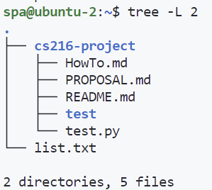

# How to use SpiderPa

The `SpiderPa`, short as `spa`, is the actual scraper we use to scrape data from Bilibili website. 

The `SpiderPa` is deployed on Zezhen@Winger_Wang's personal server located in his dorm, with the ip address of **10.197.85.181**. Thus it may be down once in a few days, **so pm him whenever you spot a problems**. The virtual machine, named "ubuntu-2", is now equipped with *2 threads* and *4 GB of RAM*, which could be expanded to up to *8 threads* and *32 GB of RAM*. It is hosted by *VMWare Workstation 16 Pro*.

The `SpiderPa` will be a public account for running the scraper, and everyone could log in with this account. Note that `SpiderPa` **does not have sudo access**; you could use pip to install packages though. Before testing anything that may change the running environment, please contact Zezhen, who will first take a snapshot of the system. 

The files in spa folder looks like this:

`cs216-project` is linked to the repo on Github, logged in with the account @Winger216. When running the scraper, use this account to pull everything from the repo first.

## Set Up

**We recommend using your own account to commit any changes you make to Git repo. You should only use this account when you want to run the scraper.**

To set up, connect your vscode to remote ssh server. You need to have the remote ssh plugin installed first. You should use the following command: `ssh spa@10.197.85.181 -p 1030`

Once connected, you would be prompted with password. The password is shared in the WeChat Group. For easier connection, we recommend you to add your own ssh public key to `~/.ssh/authorized_keys`. Do not modify any existing keys.

